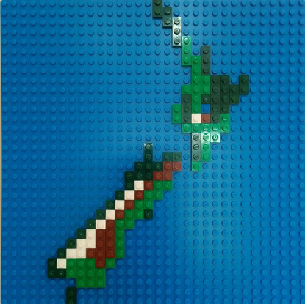
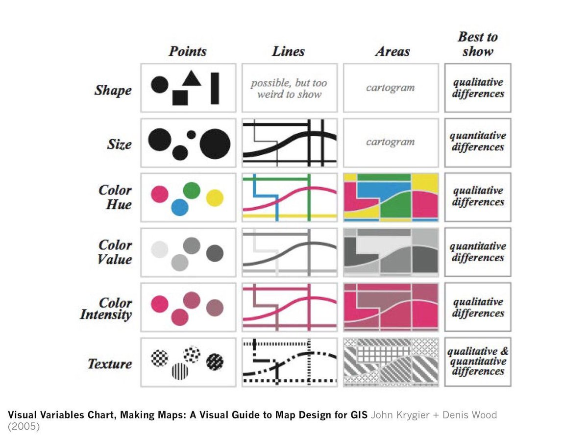

Variables visuales
~~~~~~~~~~~~~~~~~~

Definición
""""""""""

Entendemos como variable visual::

    Cualquier aspecto que puede hacer diferir una marca o señal de otra

Las variables
"""""""""""""

En el lenguaje gráfico actual se reconocen las siguientes variables

* Posición
* Forma
* Orientación
* Tamaño
* Color

  + Tono
  + Saturación
  + Valor
  + Transparencia

Las variables (cont)
""""""""""""""""""""""""""

* Estructura del relleno

  + Textura
  + Densidad
  + Módulo
  + Estructura

* Foco
* Resolución

Características
"""""""""""""""

Estas variables nos permiten a su vez representar una serie de característias:

Selectiva
   el cambio nos permite destacar elementos sobre un grupo

Asociativa
   el cambio nos permite percibir elementos como parte de un grupo

Órden
   el cambio permite apreciar un cambio en el ordenamiento de los elementos

Cuantitativa
   el cambio permite realizar apreciaciones numéricas

Elementos del diseño cartográfico
"""""""""""""""""""""""""""""""""

Por otro lado siempre entenderemos que vamos a usar las variables visuales
sobre tres tipos de elementos:

* Puntos
* Líneas
* Áreas
  
Aunque con cosas como `Kepler.gl <https://uber.github.io/kepler.gl/>`_ hay que
empezar a pensar también en volúmenes.

Posición
""""""""

La prima-ballerina en el ballet los Mapas.

En general es más bien poco *"variable"*

   La "Posición" es la variable reina de los mapas

Forma
"""""

La base de la simbología.

   Grupo de iconos Maki diseñado por Mapbox

Tiene menos sentido aplicado a Líneas y a Áreas que a Puntos

Aunque ...

   Distribución de la población en España

Orientación
"""""""""""

Algunos autores la consideran parte de la forma.

No tiene mucho sentido en Líneas.

Pero **ojo** con los posibles errores de interpretación.

   ¿Pinos o flechas?

Tamaño (o grosor)
"""""""""""""""""

Esta es una variable que solo se aplica a Puntos y Líneas.

Su uso principal es para representar **Orden**.

Un error muy común es intentar representar **Cantidad** con áreas y volúmenes

   Es muy dificil comparar a ojo tamaños de superficies y de áreas

*Cuidado* Las variaciones de tamaño hay que representarlas bien para que sean
significativas.

.. figure:: ../img/010020_008.jpg
   :alt: Mapa de datos de la producción forestal en Europa

   La correcta proporción de los símbolos ayuda a la interpretación.

La mejor proporción que se puede usar suele ser el número aureo.

.. figure:: ../img/010020_017.jpg
   :alt: Imagen con proporciones en el radio y el superficie

   Los círculos rojos tienen una progresión en el radio y los azules en la
   superficie.

Color
"""""

El pollo del arroz con pollo de los mapas.

   El color es como el Pollo

Es epecialmente poderoso y generalmente suele estar mal usado.

Tradicionalmente el color tiene tres componentes

   Tono, valor y saturación, los componentes del color

Aunque en tiempos modernos se le añade un componente más: la transparencia

   Transparencia (u opacidad) de un color

Los componentes del color se aplican por igual a Puntos, Líneas y Áreas, pero
aplicarlos bien ya es otro tema.

Algunos errores con el color
''''''''''''''''''''''''''''

El primer error que se suele cometer es usar **demasiado**::

    No más de 6 ó 7 colores diferentes en un mapa

.. figure:: ../img/010020_014.jpg
   :alt: Imágen con 11 colores diferentes

   Puede que no tengamos más remedio que hacerlo... pero protestemos y
   rechinemos de dientes.

El segundo: No todos los componentes sirven para representar todas las
características.

.. figure:: ../img/010020_015.jpg
   :alt: Mapa de coropletas con datos del paro

   Parece que en Castilla hay un gran problema... pero lo que sobretodo hay son
   grandes superficies en los municipios.

El tercero: Se debería siempre tener en cuenta que se va a hacer con el mapa y
elegir el sistema de color adecuado:

   Imprimirlo -> CMYK / Visualizarlo en pantalla -> RGB/Hex

Estructura del relleno
""""""""""""""""""""""

Los componentes de la variable dependen del autor que se consulte.

Solo se aplica a elementos que se *rellenan*, preminentemente Áreas.

.. figure:: ../img/010020_010.jpg
   :alt: Imagen con las componentes de la Estructura del relleno

   Textura, densidad, módulo y estructura conformar los componentes del relleno

En líneas puede ser un poco más complejo de *ver*

   Estructuras de relleno en líneas.

Foco
""""

Literalmente *Lo definidos que están los bordes de un objeto*

   Las variaciones de Foco hacen una figura menos definida

Para algunos autores es perfectamente sustituible por variaciones de
saturación.

Resolución
""""""""""

Cantidad de información que compone un elemento.

   La resolución a.k.a. el tamaño del pixel.

Conclusión
""""""""""

Todo buen cartografo debería tener una copia de este imagen siempre a mano:

   Uso esperado de las variables visuales.

