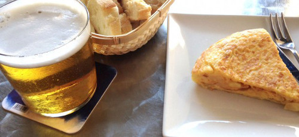

Composición
~~~~~~~~~~~

El objetivo de un mapa es transmitir información fácil y agradablemente.

Un elemento fundamental de la comunicación es la **Composición**

Pincho de tortilla y caña a que la mitad ni había oído hablar de esto.

   A la pregunta de con cebolla o sin cebolla yo siempre respondo que no soy
   tonto

*Componer* es poner un montón de cosas juntas y que resulten agradables a la
vista

   No, saber componer bien **tampoco** arregla un desastre

Elementos
"""""""""

En respuesta a ¿que son esas cosas que se ponen juntas en un mapa?

* La información geográfica
* Título
* Leyenda
* Escala
* Créditos
* Marco
* Símbolos
* Otros elementos

.. figure:: ../img/010050_003.jpg
   :alt: Imagen con elementos de un mapa

   Elementos típicos de un mapa para ser impreso

Razón
"""""

Uno de los trucos de la composición es hacer todo proporcional en la misma
razón.

En Europa podemos elegir dos **sabores**:

Norma DIN
'''''''''

.. figure:: ../img/010050_004.jpg
   :alt: Imagen de la proporción del formato DIN

   Proporción del formato DIM, basado en la raíz de 2

Razón aurea
'''''''''''

.. figure:: ../img/010050_005.jpg
   :alt: Imagen de la proporción del número áureo

   Proporción áurea

Reglas de composición
"""""""""""""""""""""

Se trata de encontrar la manera de distribuir la información de forma que el
*peso* de las cosas quede repartido armoniosamente.

   Encontrar el equilibrio

Una vez más, no se trata de algo que se aprende de golpe, se adquiere con la
práctica

Existen unas reglas que ayudan a la mejora de la composición

Estas reglas están derivadas de cómo funcionan nuestros ojos y nuestro cerebro

* El centro es menos importante que los extremos

   El centro es menos importante

* El peso aumenta en proporción a su distancia al centro

   Peso aumenta hacia los extremos

* La derecha pesa menos que la izquierda

   Peso aumenta hacia la izquierda

* Lo grande pesa más que lo pequeño

   Lo grande y lo pequeño

* Los colores cálidos pesan más que los fríos

.. figure:: ../img/010050_010.jpg
   :alt: Imagen de colores fríos y cálidos

   Lo frío y lo caliente

* Los colores oscuros pesan más que los claros (el negro pesa más que el blanco)

.. figure:: ../img/010050_011.jpg
   :alt: Imagen de colores oscuros y claros

   Lo oscuro y lo claro

* Un objeto aislado pesa más que un conjunto

   Lo aislado y el conjunto

* Las formas regulares pesan más que las irregulares

.. figure:: ../img/010050_013.jpg
   :alt: Imagen con forma regular e irregular

   Lo regular y lo irregular

* El peso tiene *gravedad*  (algo pesado *atrae* algo más ligero)

.. figure:: ../img/010050_014.jpg
   :alt: Imagen de elementos pesados y más ligeros

   El elemento pesado atrae al elemento ligero

* Las divisiones en partes iguales pesan menos que las de espacios diferentes

.. figure:: ../img/010050_015.jpg
   :alt: Imagen con divisiones espaciales diferentes

   Lo desigual y lo igual

En este paso se suele recomendar la técnica del **Espacio negativo**

.. figure:: ../img/010050_016.jpg
   :alt: Imagen ejemplo del uso del espacio negativo

   Buscando equilibrio con el espacio negativo

