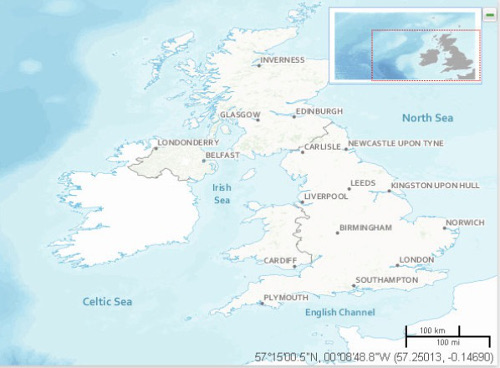

Entendiendo al usuario
~~~~~~~~~~~~~~~~~~~~~~

Aunque puede que ni él lo tenga claro, el usuario final quiere el mapa para
algo. Ese debería ser el *Mensaje* sobre el que nos tenemos que centrar:

   Mapa base para mostrar otros datos encima, el mapa debe aportar una
   referencia pero no destacar.

* ¿Cuál es la información importante para el usuario?

La información importante para el usuario debe quedar resaltada a primera
vista:

* ¿El diseño del mapa destaca la información importante? ¿Hemos empleado los
  colores y la jerarquía correctamente?

La forma de empleo final del mapa debe condicionar su diseño de cara a destacar
el mensaje:

* ¿Cómo se va a emplear el mapa? ¿el diseño es apropiado al medio?

