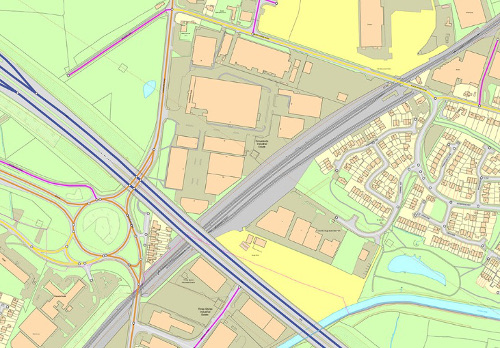

Considerar el medio de distribución
~~~~~~~~~~~~~~~~~~~~~~~~~~~~~~~~~~~

Hay que adaptar el diseño para que funcione en el medio apropiado.

Adaptar la escala, la resolución, el tipo de color (RGB para pantalla, CMYK
para impresión), considerar el grosor del papel o el tamaño del área de
visualización, la interactividad, los menús de funciones ...

   Mapa final para aplicación web

* ¿Se va a imprimir? ¿Son los textos legibles? ¿La simbología tiene el tamaño
  apropiado? ¿Los colores están adaptados?

* ¿Se va a emplear un proyector? ¿Debemos mejorar la saturación y el contraste?

