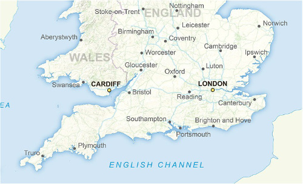

Jerarquía visual definida
~~~~~~~~~~~~~~~~~~~~~~~~~

La información que pretendemos transmitir como mensaje debe destacar claramente
sobre el resto de los elementos del mapa:

   Mapa de ciudades destacas del Reino Unido

* Cuando miro el mapa ¿Veo la información más importante primero?

* La información para contexto ¿está convenientemente amortiguada?

* Si lo convierto a escala de grises ¿La jerarquía se mantiene?

