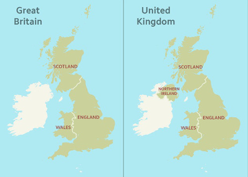

Simplicidad
~~~~~~~~~~~

Lo mejor es transmitir el mensaje con la menor cantidad de ruido posible.

Para minimizar el ruido, una regla básica, no añadir nada que no haga falta
porque no sea parte del mensaje.

   Para Gran Bretaña no hace falta añadir Irlanda del Norte.

* ¿Hay algo no aporte valor? ¡Hay que quitarlo!

* ¿Hay algo demasiado aglomerado o ruidoso? ¡Hay que quitarlo!

