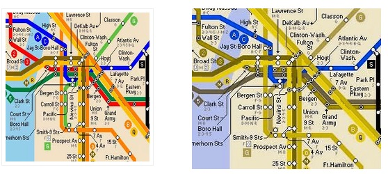

Accesibilidad
~~~~~~~~~~~~~

Se estima que en torno al 8% de la población masculina tiene una deficiencia
visual relacionada con los colores (solo un 0.5% de la femenina tiene uno).

   Mapa del metro de Nueva York, con una acesibilidad comprometida

* ¿Se han usado paletas de color que sean seguras para los daltónicos?

Otro tema que se relaciona por el mismo nombre es la accesibilidad del propio
mapa en realición con la posibilidad de acceder a la información que contiene
(fuentes) o que este pueda reutilizarse después.

Este tipo de accesibilidad a la información está muy condicionado por el tipo
de mapa, el origen de los datos, las licencias implicadas, etc.

* ¿El mapa resultado es fácilmente accesible al usuario final?

