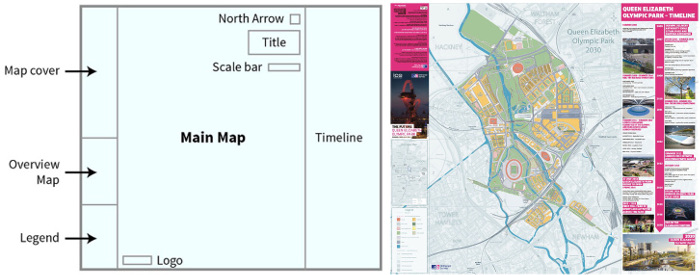

Composición
~~~~~~~~~~~

El *OS* también destaca que la composición es uno de los elementos
fundamentales del diseño.

   Composición y resultado

* ¿Están todos los elementos ordenados limpiamente?
* ¿Hay suficiente *Espacio blanco* para que los elementos resulten claros y
  legibles?
* ¿La información más importante es la que más destaca?

